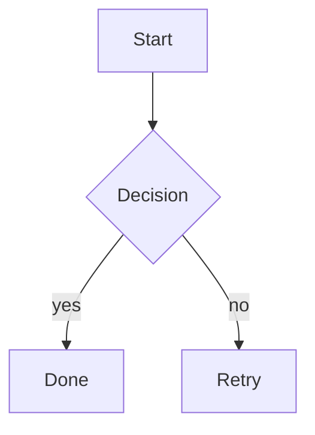

# html-preview

Convert markdown to a self-contained, rich HTML page → upload to GCS → return a time-limited Signed URL.

Designed to be **product-agnostic** and usable from any project. Lives under `~/.dotfiles/claude/tools/html-preview/` and is symlinked into `~/.claude/` via the dotfiles structure.

---

## Quick start

### From Claude Code

```
/html-preview "週次レポート"
```

This grabs the most recent assistant message, renders it as rich HTML, uploads to GCS, and returns a Signed URL.

Optional flags:

```
/html-preview "タイトル" --expires 3 --open
/html-preview --dry-run                # preview locally without uploading
/html-preview --allow-secrets          # bypass secret detection
```

### From the terminal

After making the wrapper at `~/.local/bin/html-preview` executable:

```bash
chmod +x ~/.local/bin/html-preview

# Inline content
html-preview --title "Hello" --content "# Hi"

# From file
html-preview --title "Report" --content-from-file report.md

# From stdin
echo "# From stdin" | html-preview --title "Pipe demo" --content-from-file -

# Dry-run (local HTML only)
html-preview --title "Local check" --content-from-file in.md --dry-run --open
```

---

## Features

| Feature | Description |
|---|---|
| **TOC + scroll-spy** | h2/h3 から目次自動生成、スクロール追従ハイライト |
| **Syntax highlight** | highlight.js (atom-one-dark, 言語自動検出) |
| **Copy button** | コードブロックホバーで出現 |
| **Chart.js** | ` ```chart` ブロックに JSON 設定 |
| **mermaid** | ` ```mermaid` ブロックでフロー/シーケンス図 |
| **KaTeX** | `$$...$$` で数式 |
| **Custom containers** | `:::note`/`:::tip`/`:::warning`/`:::danger`/`:::info` |
| **Dark mode** | OS連動 + 手動トグル (light/dark/auto, localStorage 永続化) |
| **Image zoom** | 画像クリックでモーダル拡大 |
| **Print optimized** | `@media print` で配布用に整形 |
| **Responsive** | モバイル/タブレット/PC |

---

## CLI options

```
html-preview [options]

  -t, --title <text>            Page title
  -c, --content <markdown>      Inline markdown content
  -f, --content-from-file <p>   Read markdown from a file (use "-" for stdin)
  -e, --expires <days>          Signed URL validity (1-7 days, default 7)
  -s, --slug <text>             Custom URL slug
  --dry-run                     Generate HTML locally without uploading
  --open                        Open the URL in the browser
  --allow-secrets               Skip secret detection
```

### Exit codes

| Code | Meaning |
|---|---|
| 0 | Success |
| 1 | Generic error |
| 2 | Config error (missing/invalid `~/.config/html-preview/config.json`) |
| 3 | Secrets detected in content |
| 4 | Upload / network error |
| 5 | Input error (file not found etc.) |

---

## Markdown extensions

### Charts (Chart.js)

````markdown
```chart
{
  "type": "bar",
  "data": {
    "labels": ["Mon","Tue","Wed"],
    "datasets": [{ "label": "PV", "data": [12,19,15], "backgroundColor": "#0969da" }]
  }
}
```
````

### Diagrams (mermaid)

````markdown

````

### Math (KaTeX, block only)

```markdown
$$
\int_{-\infty}^{\infty} e^{-x^2} \, dx = \sqrt{\pi}
$$
```

### Containers

```markdown
:::note 知っておくと便利
通常メモ用 (青)
:::

:::tip ベスト
推奨事項 (緑)
:::

:::warning 注意
注意喚起 (黄)
:::

:::danger 警告
重大な警告 (赤)
:::

:::info 情報
情報メモ (紫)
:::
```

---

## Configuration

### Config file: `~/.config/html-preview/config.json`

```json
{
  "gcp": {
    "projectId": "<YOUR_PROJECT>",
    "bucket": "<YOUR_BUCKET>",
    "credentialsPath": "~/.config/html-preview/sa.json"
  },
  "defaults": {
    "expiresInDays": 7
  }
}
```

### Environment overrides

| Variable | Overrides |
|---|---|
| `HTML_PREVIEW_PROJECT_ID` | `gcp.projectId` |
| `HTML_PREVIEW_BUCKET` | `gcp.bucket` |
| `GOOGLE_APPLICATION_CREDENTIALS` | `gcp.credentialsPath` |

### GCP infrastructure (Phase 1 setup)

- **Bucket**: `<YOUR_BUCKET>` in `asia-northeast1`
  - Uniform bucket-level access
  - Public access prevention: enforced
  - Lifecycle: delete after 30 days
- **Service Account**: `<YOUR_SA>@<YOUR_PROJECT>.iam.gserviceaccount.com`
  - Role: `roles/storage.objectAdmin` (bucket-scoped)
- **Key**: `~/.config/html-preview/sa.json` (chmod 600)

---

## Security model

- **Bucket is fully private**. Only Signed URLs can read objects.
- **Signed URL** uses GCS V4 (HMAC-SHA256, RSA-2048). Unguessable.
- **URL = capability**: anyone with the URL can view it during the validity period (default 7 days). Treat URLs like passwords.
- **Auto-deletion**: objects are deleted 30 days after upload via lifecycle rule.
- **Secret scanner** detects 12 patterns (AWS/GCP/GitHub/Slack/OpenAI/Anthropic/Stripe keys, JWTs, private key blocks, suspicious HTML) and blocks upload by default.
- **URL sanitization**: `javascript:`, `vbscript:`, and `data:text/html` URLs in markdown links/images are neutralized.
- **No raw HTML execution from input**: outbound links get `rel="noopener noreferrer"`.

---

## Troubleshooting

### `Config not found at ~/.config/html-preview/config.json`

Run Phase 1 setup. Minimum:

```bash
gcloud iam service-accounts keys create ~/.config/html-preview/sa.json \
  --iam-account=<YOUR_SA>@<YOUR_PROJECT>.iam.gserviceaccount.com
```

Then create `~/.config/html-preview/config.json` (see above).

### `Authentication failed (HTTP 401|403)`

The SA key is invalid, expired, or the SA lacks bucket permissions. Verify:

```bash
gcloud storage buckets get-iam-policy gs://<YOUR_BUCKET> \
  --filter="bindings.members:serviceAccount:<YOUR_SA>@<YOUR_PROJECT>.iam.gserviceaccount.com"
```

### `Bucket or object not found (HTTP 404)`

Verify `gcp.bucket` in `config.json` matches an existing bucket.

### `Network error (ENOTFOUND/ECONNREFUSED/ETIMEDOUT)`

Connectivity issue. Check VPN / firewall / `gcloud auth list`.

### Secrets detected — but it's intentional (e.g. demo content)

Use `--allow-secrets` (CLI) or pass `--allow-secrets` as part of `/html-preview` arguments.

---

## Project layout

```
~/.dotfiles/claude/tools/html-preview/
├── bin/
│   └── html-preview.ts          # CLI entry
├── src/
│   ├── config.ts                # config loader + env override
│   ├── errors.ts                # CliError + exit codes + GCS error formatting
│   ├── slug.ts                  # slugify + object path builder
│   ├── generator/
│   │   ├── escape.ts            # HTML escape util
│   │   ├── markdown.ts          # marked custom renderer + extensions
│   │   └── template.ts          # HTML shell + CSS + inline JS
│   ├── security/
│   │   ├── secretScan.ts        # 12 secret patterns
│   │   └── sanitize.ts          # URL protocol validation
│   └── storage/
│       ├── client.ts            # @google-cloud/storage factory + constants
│       ├── gcs.ts               # upload
│       └── signedUrl.ts         # V4 Signed URL
├── package.json
├── tsconfig.json
├── .gitignore
└── README.md
```

The slash command is at `~/.dotfiles/claude/commands/html-preview.md` (symlinked to `~/.claude/commands/`).

---

## Maintenance

```bash
# Type check
cd ~/.dotfiles/claude/tools/html-preview && npm run typecheck

# Update CDN versions: edit src/generator/template.ts
#   HLJS_VERSION, MERMAID_VERSION, CHARTJS_VERSION, KATEX_VERSION

# Add a new container kind: edit VALID_CONTAINERS in src/generator/markdown.ts
#   and add CSS rules in src/generator/template.ts (.hp-container-<kind>)

# Add a new secret pattern: edit PATTERNS in src/security/secretScan.ts
```
